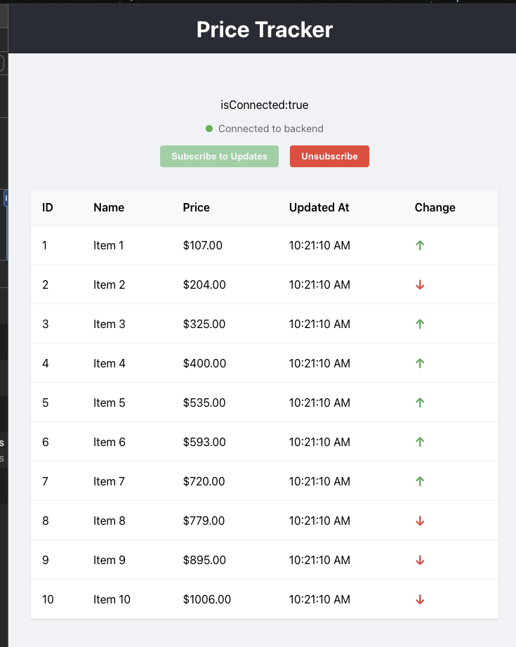

# Price Tracker Application

A real-time price tracking application built with React (TypeScript) and .NET. The application displays a list of items with their prices and provides real-time price updates.



## Features

- Display a list of 10 items with their IDs, names, prices, and last update times
- Real-time price updates every second
- Subscribe/Unsubscribe functionality for price updates
- Visual indicators for price changes (up/down arrows)
- Clean and modern UI without external styling libraries

## Technical Implementation

### Frontend
- React with TypeScript
- Custom CSS for styling
- Efficient state management using React hooks
- Responsive design
- Real-time updates using setInterval (to be replaced with SignalR)

### Backend 
- .NET Web API
- SignalR for real-time updates
- RESTful endpoints for initial data
- WebSocket connection for price updates

## Getting Started

### Frontend
1. Navigate to the frontend directory:
   ```bash
   cd ui
   ```
2. Install dependencies:
   ```bash
   npm install
   ```
3. Start the development server:
   ```bash
   npm start
   ```
4. To run unit tests:
   ```bash
   npm test
   ```


### Backend
1. Navigate to the api/PriceTrackerApi directory
2. Install .NET SDK
3. Run the application
```bash
    dotnet build 
    dotnet run
   ```
5.  To run unit tests:
```bash
    cd api/PriceTrackerApi.UnitTests
    dotnet build 
    dotnet test
   ```

## Potential Improvements

1. **Backend Integration**
   - Add unit tests for service layer 
   - Add functional tests using Playwright 
   - Can add contract testing for apis
   - Add proper error handling and reconnection logic
   - Implement proper data persistence

2. **Frontend Enhancements**
   - Add loading states
   - Implement error boundaries
   - Add unit tests using Jest and React Testing Library
   - Add end-to-end tests using Cypress / Playwright
   - Implement proper TypeScript types for API responses
   - Add proper error handling for failed updates

3. **Performance Optimizations**
   - Implement proper memoization for expensive calculations
   - Add virtualization for large lists
   - Optimize re-renders using React.memo
   - Implement proper WebSocket connection management

4. **User Experience**
   - Add animations for price changes
   - Implement sorting and filtering
   - Add search functionality
   - Add pagination for large datasets
   - Add dark mode support

5. **Security**
   - Implement proper authentication
   - Add rate limiting
   - Implement proper CORS policies
   - Add input validation

6. **Monitoring and Logging**
   - Add proper logging
   - Implement error tracking
   - Add performance monitoring
   - Implement analytics
